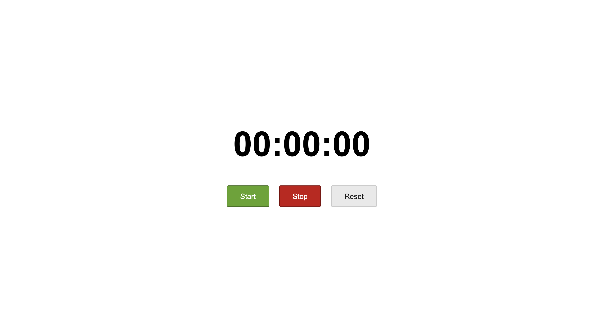

# vanilla-js-stopwatch

* Basic stopwatch that displays hours, minutes and seconds elapsed
* Inspiration from the tomato timer I frequently used when studying during uni
* Link to Tomato Timer (https://www.toptal.com/project-managers/tomato-timer)

See live demo here: https://jasvirboparoy.github.io/vanilla-js-stopwatch/